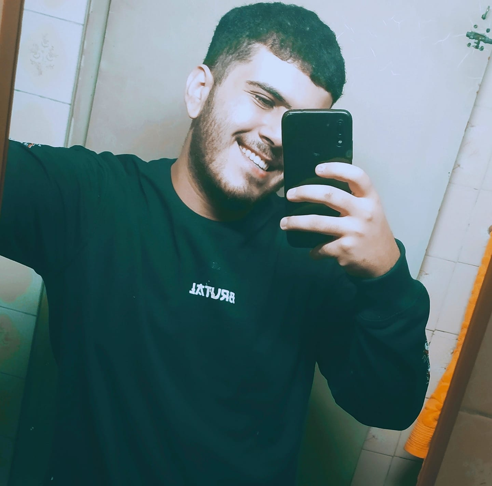

<h3 align="center">Landing Page desenvolvida para o desafio da FCamara em parceria com a ImersãoDev.</h3>

**<h4 align="center">Para testar a aplicação <a href="https://sad-ride-79e77d.netlify.app">clique aqui!</a> </h4>**

---

<h2 align="center">Demonstração</h2>

## 🛠 Tecnologias

As seguintes ferramentas foram usadas na construção do projeto:

- [HTML5](https://developer.mozilla.org/pt-BR/docs/Web/HTML)
- [CSS3](https://developer.mozilla.org/pt-BR/docs/Web/CSS)
- [JavaScript](https://developer.mozilla.org/pt-BR/docs/Web/JavaScript)
-------

## :hammer: Utilitarios

- Photoshop
- [StorySet](https://storyset.com)
- [BoxySVG](https://boxy-svg.com)

---

## 👨‍💻 Autor

<table>
  <tr>
    <td align="center"><a href="https://www.linkedin.com/in/patrick-barbosa-7b1505137/"> <b>Patrick Barbosa</b></a> </td>
  </tr>
</table>